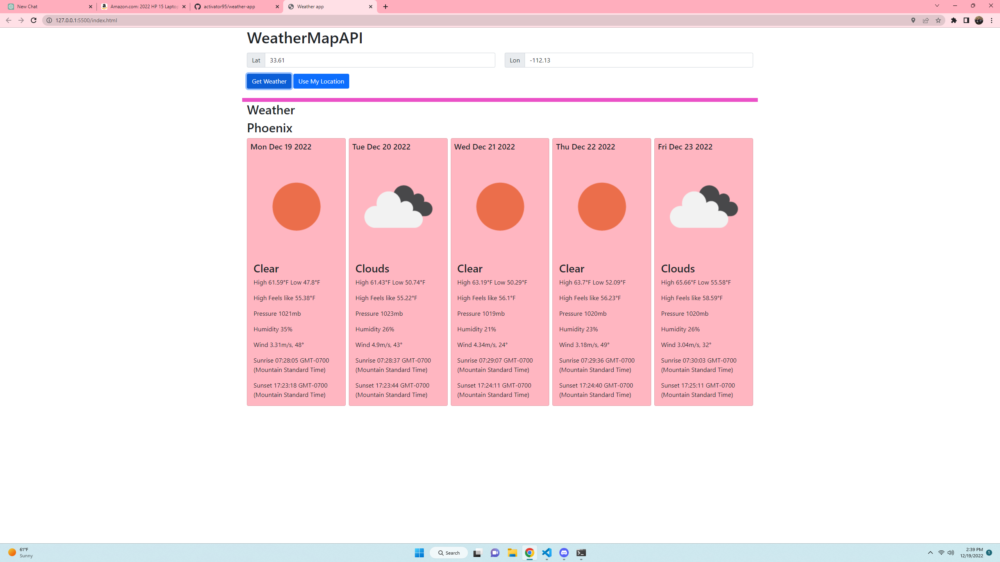

# project name is  README generator

## Description
building a readme generator to generate readme 
readme.png

## 📝 Table of Contents
- <a href="#description">Description</a>
- <a href="#installation">Installation</a>
- <a href="#usage">Usage</a>
- <a href="#contributors">Contributors</a>
- <a href="#license">License</a>
- <a href="#questions">Questions</a>
- <a href="#tests">Tests</a>

## Usage
run node index.js and input answers to the question in terminal

## Installation
install I

https://drive.google.com/file/d/1yGOEVqMtqwp216SDhmnIFe9hLa6U38zc/view

## Contributors
Justin

## Tests
NONE

## Questions
GITHUB: https://github.com/Activator95/

Contact Justinsemail12@yahoo.com

## License
This project is under MIT license

